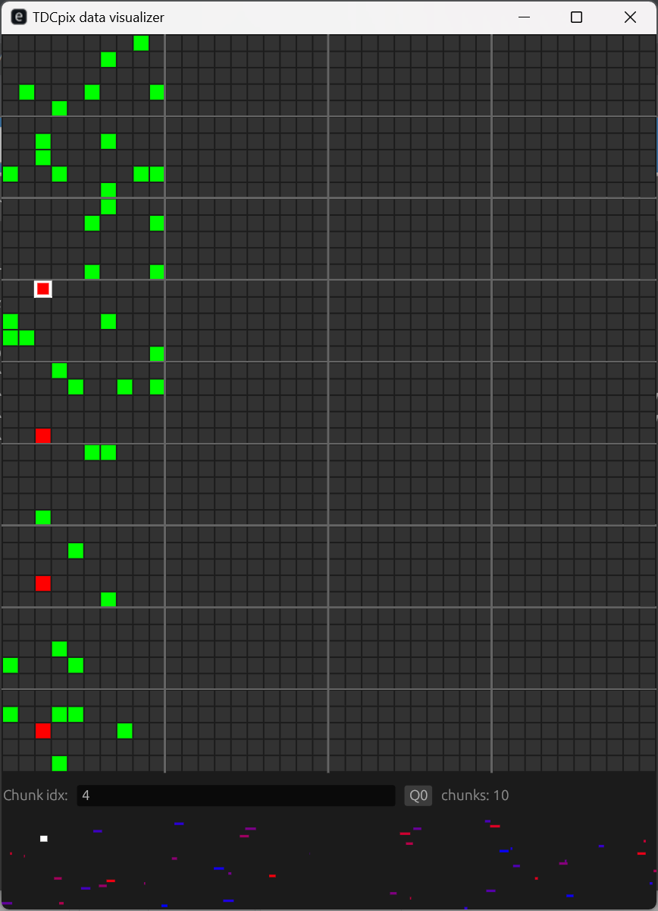
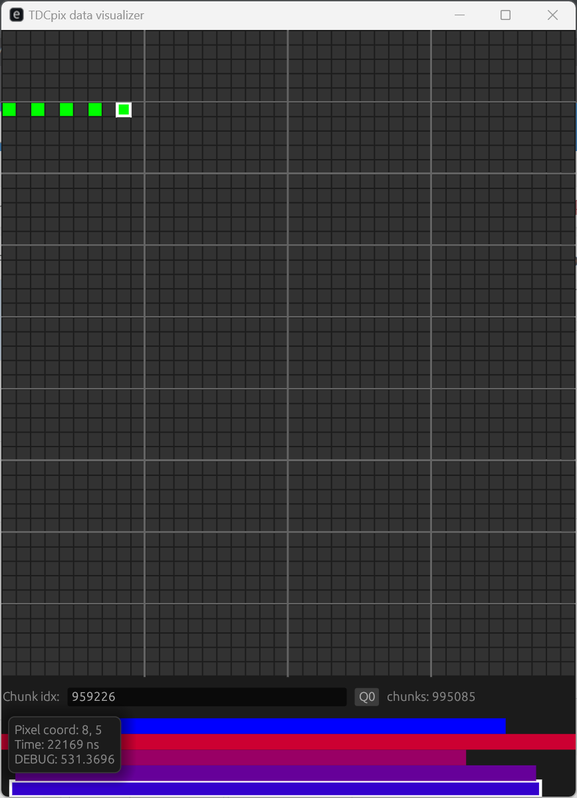

# What is this?
This is a small eframe (egui) application for visualizing the hits from the TDCpix ASIC on the Gigatracker at the NA62 experiment at CERN. It is written in Rust.

# Why is this?
This came into existance as a consequence of me trying to understand the data i was getting from the TDCpix ASIC in relation to the testing i did with the firmware i wrote for the FELIX PCIe card.

# Limitations
As of now i have only implemented pixel hit-mapping for the first quarterchip.

# What am i looking at?
The application shows a visualization of the TDCpix ASIC with the four quarter-chip regions seperated by the four vertical lines. When data is loaded the hits will appear as green dots and if there is pileup on an arbiter, the affacted pixels will be drawn in red. In the buttom there is a timeline from left to right with the time of each hits shown on mouse hover. If you click a pixel you can see the corresponding box highlighted in the buttom timeline.

    </img>
    </img>

# How to build
I think you should just be able to do cargo build. I found that in the current state with a lot of widgets drawn the the screen, a --release build does not hurt, as it makes the application way faster and the build time is still very short.
